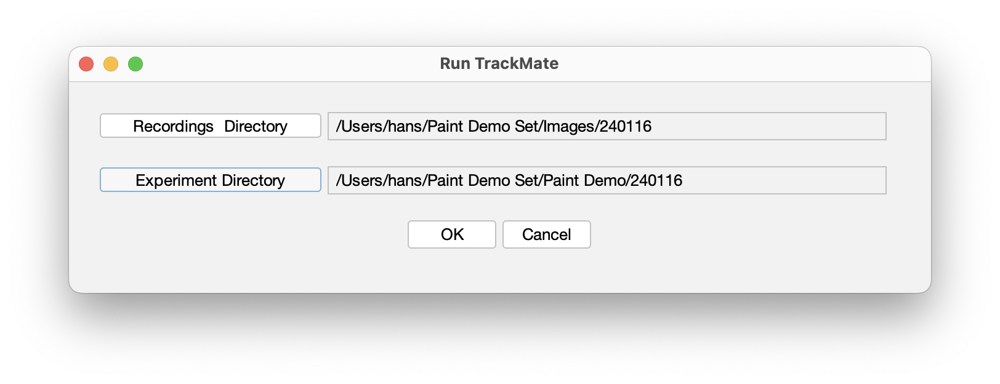
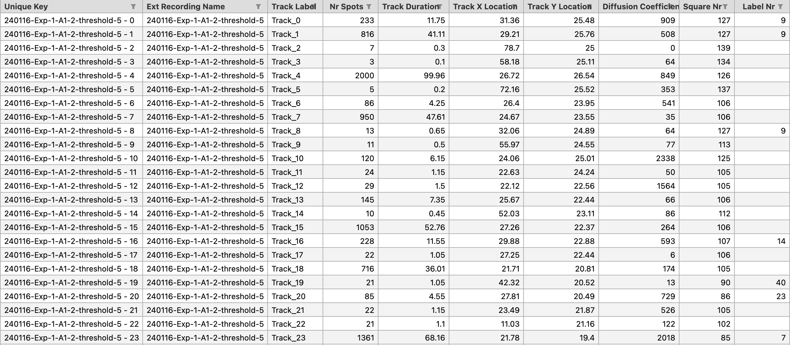
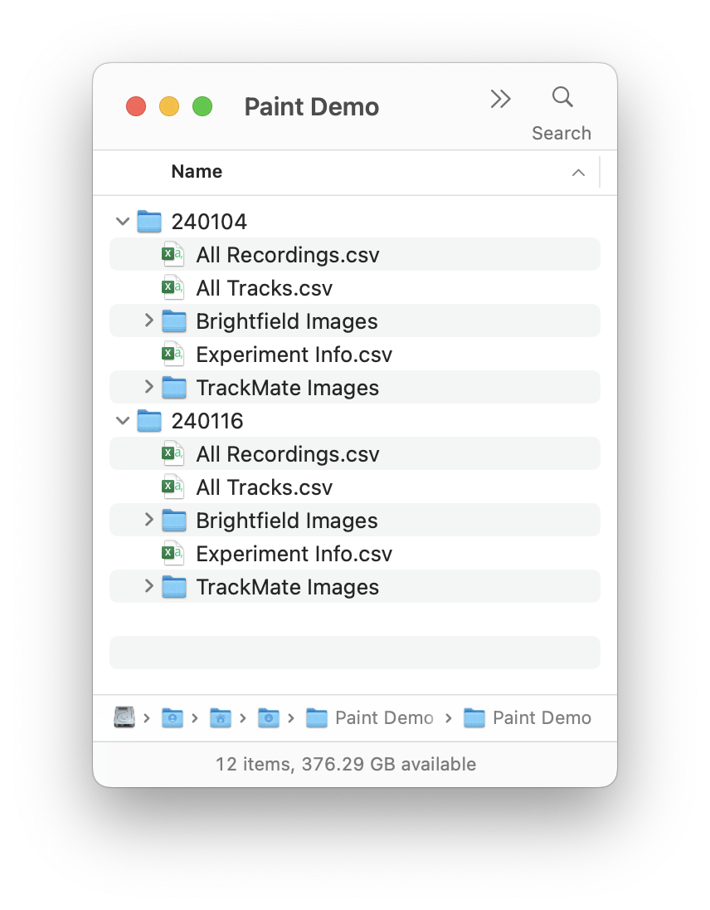
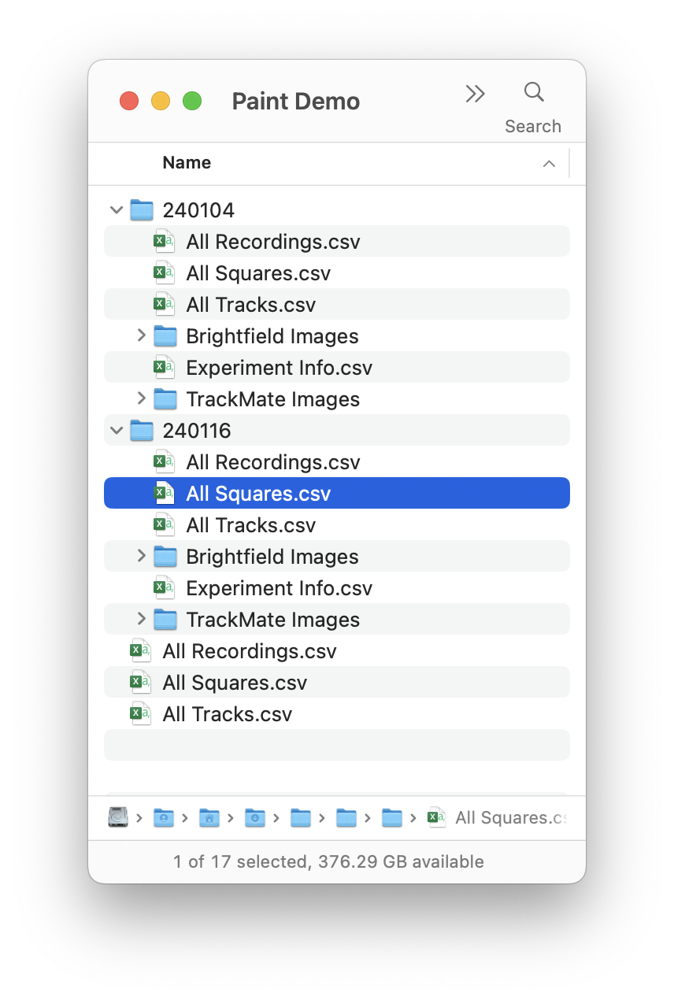
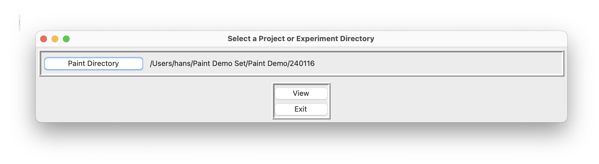
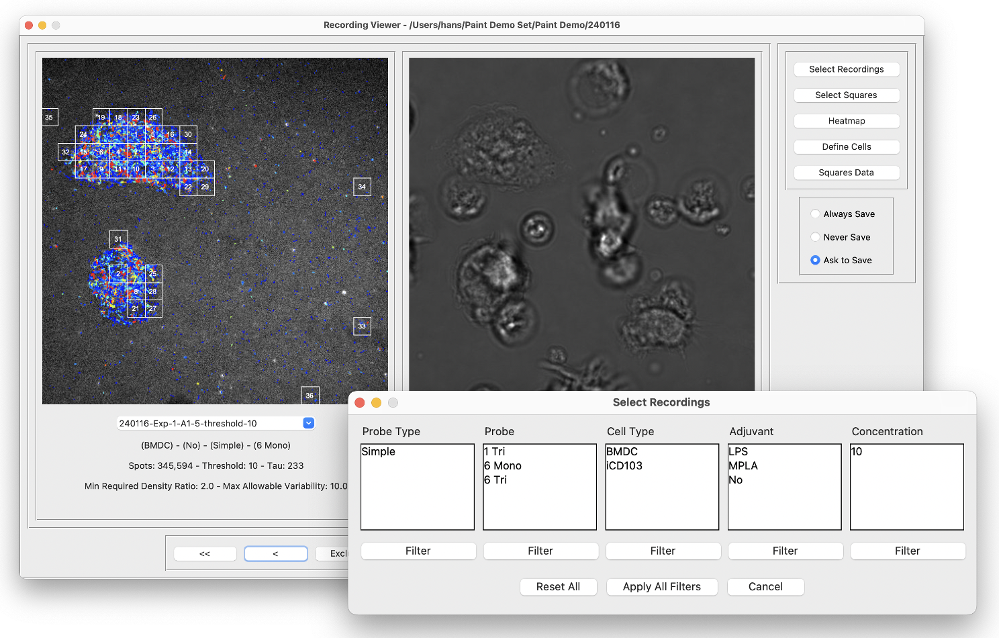
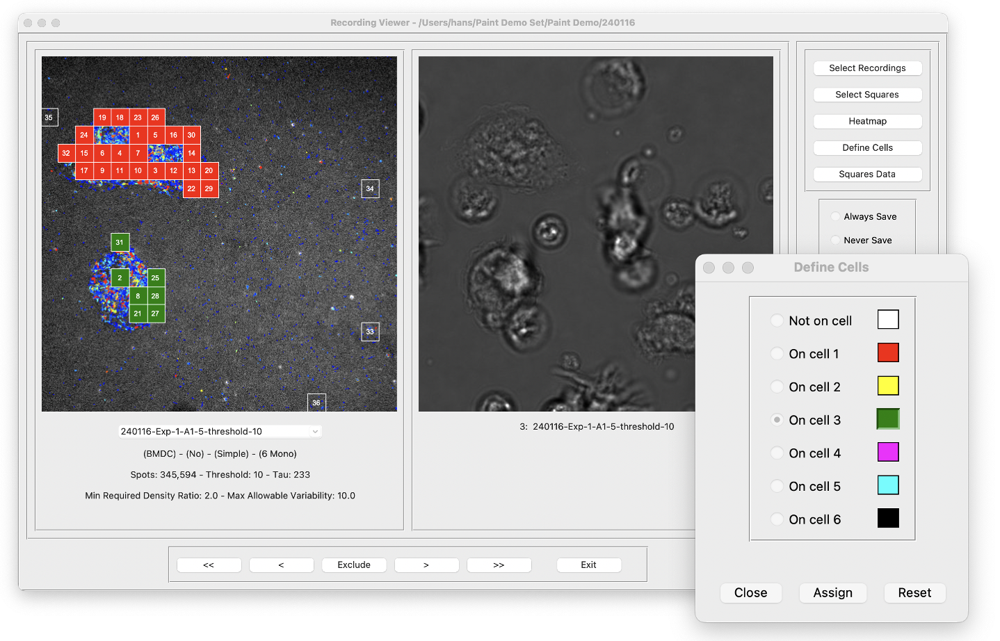
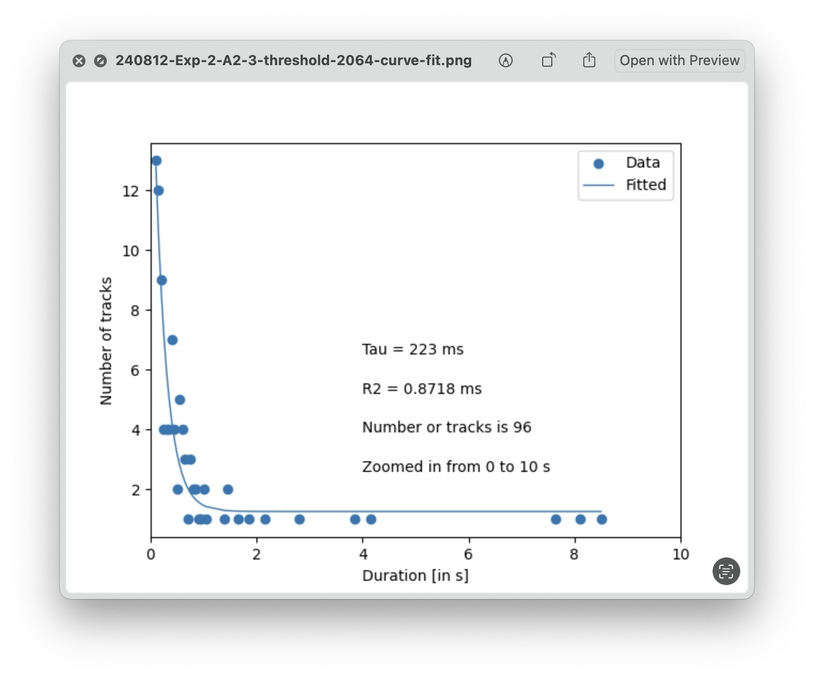
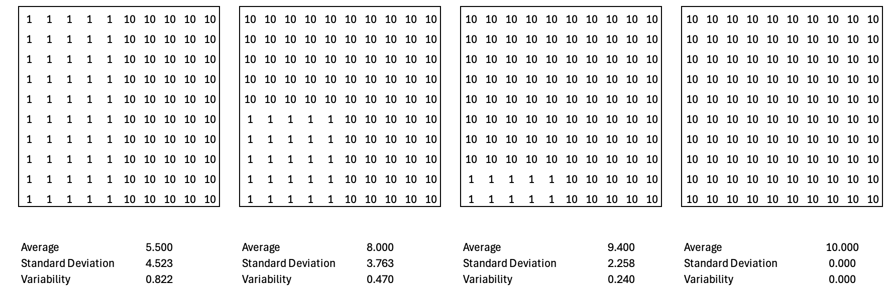

**GlycoPaint Pipeline**

Functional description

{width="2.9064818460192474in"
height="2.9064818460192474in"}

November 2024

Table of Contents

[1 Overview - The Dataflow in the GlycoPaint pipeline
[4](#overview---the-dataflow-in-the-glycopaint-pipeline)](#overview---the-dataflow-in-the-glycopaint-pipeline)

[2 Pipeline Concepts [6](#pipeline-concepts)](#pipeline-concepts)

[3 Process Flow [7](#process-flow)](#process-flow)

[3.1 Overview [7](#overview)](#overview)

[3.2 Prepare Experiment Info
[8](#prepare-experiment-info)](#prepare-experiment-info)

[3.3 Run TrackMate [10](#run-trackmate)](#run-trackmate)

[3.4 Generate Squares [12](#generate-squares)](#generate-squares)

[3.5 Compile Project [14](#compile-project)](#compile-project)

[3.6 Visual Inspection [15](#visual-inspection)](#visual-inspection)

[3.6.1 Select Recordings [16](#select-recordings)](#select-recordings)

[3.6.2 Select Squares [17](#select-squares)](#select-squares)

[3.6.3 Define Cells [18](#define-cells)](#define-cells)

[3.6.4 Show Heatmap [18](#show-heatmap)](#show-heatmap)

[4 Data formats [20](#data-formats)](#data-formats)

[4.1 All Recordings Format
[20](#all-recordings-format)](#all-recordings-format)

[4.2 All Squares format [21](#all-squares-format)](#all-squares-format)

[4.3 All Tracks [22](#all-tracks)](#all-tracks)

[5 Algorithms [23](#algorithms)](#algorithms)

[5.1 Tau [23](#tau)](#tau)

[5.2 Variability [23](#variability)](#variability)

[5.3 [24](#section)](#section)

[5.4 Square Density [24](#square-density)](#square-density)

[5.5 Background Density and Density Ratio
[24](#background-density-and-density-ratio)](#background-density-and-density-ratio)

[5.6 Diffusion Coefficient
[25](#diffusion-coefficient)](#diffusion-coefficient)

[6 Parameters [26](#parameters)](#parameters)

[6.1 Paint Application parameters
[26](#paint-application-parameters)](#paint-application-parameters)

[6.2 TrackMate parameters
[27](#trackmate-parameters)](#trackmate-parameters)

[7 Paint directories [28](#paint-directories)](#paint-directories)

[8 Logging [29](#logging)](#logging)

[9 Structure of Generate Squares
[30](#structure-of-generate-squares)](#structure-of-generate-squares)

# Overview - The Dataflow in the GlycoPaint pipeline

Cells are observed under a microscope for 100 seconds, capturing 2000
images during this interval. Bright spots, which represent fluorophores,
are visible in these images. These spots may move and often disappear
after a short period. Their appearance signifies that a fluorophore has
remained stationary long enough to be detected by the camera. In the
GlycoPaint method, such events are interpreted as glycans (attached to
fluorophores) binding to lectins on the cell surface. A key challenge is
distinguishing these biologically relevant events from non-specific
fluorophore sticking.

Using the Fiji plugin TrackMate, spots are detected in each frame, and
their positions registered. Tracks are then created by connecting spots
across consecutive frames. Each track is characterized by features such
as its duration, average x and y positions, and distance travelled. If a
lectin-glycan pair were completely stationary, the resulting track would
consist of a series of spots in the same location, with no movement.
However, lectin-glycan pairs typically move slightly within the cell
membrane, resulting in tracks that resemble small 'wriggles'. These
tracks are not evenly distributed across the image but are typically
concentrated on the cell surface and show heterogeneous patterns within
a cell.

An average recording may contain around 800,000 spots, from which
approximately 50,000 tracks are constructed. A grid is then overlaid on
the recording, commonly using a 20x20 or 30x30 grid, dividing the image
into 400 or 900 squares. Each track, based on its x and y coordinates,
is assigned to a square. Diving the image into squares allows for the
investigation of differences between cells or between regions within a
cell.

In the GlycoPaint pipeline, the primary unit of analysis is not an
individual recording but a set of recordings grouped into an Experiment.
Data processing generates two main datasets:

-   **All Squares**: A table containing summarised information on all
    tracks across all recordings in the experiment.

-   **All Tracks**: A table containing detailed information on every
    track in the experiment.

Both datasets serve as the foundation for further analysis.

A lot of data is generated. For an experiment with 14 recordings and a
20x20 grid, the All Squares table would contain 5600 rows (or 12,600
rows for a 30x30 grid) and the All Tracks table might contain between
100,000 and 400,000 rows.

The scope of the GlycoPaint pipeline is to extract information from the
Recordings and to extract the maximum amount of meaningful summary
information from the images for subsequent processing.

Important features of the pipeline are that the results are fully
reproducible, require minimal user intervention and are efficient in
terms of processing time and

# Pipeline Concepts

The Paint Pipeline was developed to analyse (bulk) data from Glyco-PAINT
experiments. The interaction of weak-binding ligands to receptors on
live cells is studied on varying cell types, ligands and adjuvants.
Binding events show up as bright spots under a fluorescent microscope.
Analysis of the location and duration of spots reveal information about
single binding events.

**Recording**

{width="1.9444444444444444in"
height="2.9166666666666665in"}The central concept in PAINT is the
recording of binding events. A recording consists of a brightfield image
to identify the position of cells and a multi-frame image in which the
spots, indicative of binding events, are recorded. In our experiments,
we observe cells for 100 seconds, with 2000 frames at 50 milli-second
intervals.

**Experiment**

A set of recordings is referred to as an experiment. Typically, an
experiment is conducted in one day, with up to 100 individual
recordings. Normally, several conditions are studied in an experiment
and several replicates are recorded for each condition.

**Project**

A project is a set of experiments, that together are analysed.
Experiments in a project may be replicates of earlier conducted
experiments or introduce new combinations of cell types, probes or
adjuvants.

For example, a hierarchy is shown of a project consisting of two
experiments, with 4 recordings each.

**Metadata**

For recordings metadata needs to be provided for the Paint pipeline to
work. On top of that, a simple convention for naming the recordings is
used. For example, from the name '240116-Ex1-1-A1-1', the following can
be derived:

240116-Exp-1-A1-1: Part of experiment 240116

240116-Exp-[1]{.underline}-A1-1: Operating condition 1

240116-Exp-1-A1-1: Microscopic plate well A1

240116-Exp-1-A1-1: Replicate 1

# Process Flow

## Overview

{width="2.498611111111111in"
height="4.720138888888889in"}The Glyco-Paint process starts with a
**microscopy experiment**, in which binding events are observed under a
fluorescent microscope. Such an experiment leads to a set of recordings,
each consisting of a bright field image and a multi-frame image.

The user subsequently prepares the **Experiment Info** by providing
metadata for the recordings. The metadata specifies properties such as
Cell Type, Probe Type, Concentration and Adjuvant and provides some
necessary processing parameters.

The experiment data is analysed in **TrackMate** which detects spots in
each frame of the multi-frame set and connects these spots into tracks
where appropriate. A track represents a binding event with the length of
the track indicating the duration of the binding event.

With the tracks available, the **Generate Squares** step overlays a fine
grid of squares over each recording, establishing the properties of each
of the squares, for example, whether the square covers an area of
interest or likely background.

**Compile Project** combines all available data into large data tables
containing all information of interest.

These tables are used in the **R Analysis** phase where the data is
selected, processed and presented in line with research objectives.

**Visual Inspection** of the results is possible at any time after the
squares have been generated, both recordings in an experiment or all
recordings in a project.

## Prepare Experiment Info

The metadata of the experiment is information about the conditions under
which each recording is made and recorded in an 'Experiment Info' file.
The Paint processing pipeline contains a 'Prepare Experiments Info'
utility to prepare this file. The user provides two parameters: the
directory that contains the recordings and the location of the Paint
Experiment directory where the Experiment Info file (and all subsequent
data) will be written (Figure 1).

> Figure 1 The Prepare Experiments Info dialog box that will trigger the
> creation of an empty experiments.csv file

After this has been done for both demo experiments, two directories have
been created each with an 'Experiment Info' file (Figure 2).

> Figure 2 The content of the Project Directory with two Experiment
> directories, which at this point contain only the Experiment Info
> files.

If the Paint file naming convention is used, columns such as Experiment
Date, Experiment Name, Condition Nr and Replicate Nr will be filled in
automatically, if not the user has to provide this information (Figure
3).

{width="6.268055555555556in"
height="2.584722222222222in"}

> Figure 3 An experiment Info file created by 'Prepare Experiments Info
> File'. The metadata has still to be supplied by the user. (The names
> of some columns have been shortened for readability).

An example of a fully specified Experiment Info file, with values for
Probe, Probe Type, Cell Type, Adjuvant and Concentration provided is
shown in Figure 4). The Threshold parameter is necessary for TrackMate
processing (refer to next section). The 'Process' flag indicates whether
a recording is processed or ignored.

{width="6.268055555555556in"
height="2.39375in"}

> Figure 4 An experiment Info file in which the user has supplied
> metadata. (The names of some columns have been shortened for
> readability).

The 'Brightfield Images' directory holds JPG versions of the Brightfield
images, converted from the original Nikon '.nd2' format. These files
will be needed later in the Visual Inspection phase.

## Run TrackMate

The Trackmate plugin in the Fiji environment is used to analyse the
recordings, detect spots and connect spots to tracks where possible.

The Experiment info 'Threshold' parameter determines the spot detection
sensitivity. With a low threshold value, even not very well-defined
spots are detected. With a high threshold value, poorly defined spots
are ignored. Experience indicates that with 1,000,000 plus spots,
processing becomes very lengthy and does not lead to usable results. The
user chooses for each recording a threshold value in an iterative
process. The threshold should be set so that the number of spots
preferably is in the 300,000 to 800,000 range. A good starting value for
the Threshold is 20.

The 'Run Trackmate' procedure is started from Fiji by selecting from the
'Plugins' menu the Paint group and in there 'Run Trackmate'. A dialog
box to select the Recordings Directory and Experiment Directory is
displayed (Figure 5).

<figure>

<figcaption><blockquote>

Figure 5 The Fiji dialogue box in which the TrackMate processing is
started. The Experiment Directory refers to where the Experiment Info
file is stored, and the Recordings Directory points to where the
recordings referred to in the Experiment Info file are stored.

</blockquote></figcaption>
</figure>

Upon successful processing, the system generates for each recording an
image. A representative example of an image is shown in Figure 6.

> Figure 6 An example of an image generated by TrackMate with tracks
> superimposed on the recording. Track colours indicate track duration.
> Dark colours (i.e. blue) indicate short tracks, bright colours
> indicate long tracks.

For the set of recordings in the experiment, the system generates one
'All Tracks' and one 'All Recordings' file with attributes such as Nr
Spots, Nr Tracks, Run Time and a Time Stamp. The 'All Tracks' file
contains, for every track, the average x and y position, and the number
of spots and track duration. In addition, the diffusion coefficient (a
measure of the displacement from the origin) has been calculated. An
example is shown below in Figure 7.

{width="6.268055555555556in"
height="2.740972222222222in"}

> Figure 7 An example of a tracks file containing data on the tracks
> found in the experiment.

The Project directory contents just after TrackMate has been run for the
230531 experiment is shown in Figure 8.

> {width="2.3622047244094486in"
> height="3.0236220472440944in"}
>
> Figure 8 The contents of the Project directory, just after TrackMate
> has been run for both experiments. The 'All Tracks' file and the
> 'TrackMate Images' directory are new. The 'All Recordings' file is
> based on the 'Experiment Info' file with some additional information
> added.

## Generate Squares

With the tracks for the experiment available in the 'All Tracks' file,
the recordings in the or (or for all experiments in a Project folder)
are analysed by superimposing a grid over the image and determining the
characteristics of each square. The user interface to invoke this
function is shown below.

> Figure 9 The user dialogue to start generating squares. The user can
> specify an Experiment or a Project Directory.

The Number of Squares in a Row (and Column) determines the size of the
squares in the grid (typical values are 20 or 30). The number of tracks
is determined for each square. The 10% least dense squares determine a
'background' density. All square densities are compared to this
background density. If the ratio exceeds the 'Minimum Required Density
Ratio', squares are interpreted to be sufficiently distinct from the
background to be of interest.

The homogeneity of squares is also determined and, if requested, the
lack of homogeneity, i.e. the variability, can be limited.

A histogram of track durations is generated for each square that meets
the specified density and variability criteria. Tau is then calculated
through curve fitting. To ensure accurate curve fitting, a minimum
number of data points (tracks) is required. The user can define this
threshold with the 'Minimum Tracks to Calculate Tau' parameter.

The quality of curve fitting is expressed in an R^2^ parameter. An R^2^
value of 1 indicates a perfect, values lower than 0.5 that a fit was
difficult. The user-specified 'Min allowable R-squared' parameter sets a
limit to how the required quality of fit.

For all squares in each recording, several attributes are calculated:

-   The number of tracks

-   The duration of the longest track

-   The average duration of the longest 10 tracks

-   The total track duration

-   The Tau (provided that the squares meet the selection criteria

-   The R^2^ indicating the quality of the Tau curve fitting

With the 'Generate Squares' function run, the directory structure is
shown in Figure 10.

{width="2.3622047244094486in"
height="3.204724409448819in"}

> Figure 10 The directory structure after 'Generate Tracks' has been
> run. The 'All Squares' file is the new addition.

## Compile Project

Typically, data to be analysed comes from more than one experiment. With
the Compile project option (Figure 11), the data from the experiments in
the project are compiled and an 'All Recordings', 'All Squares' and 'All
Tracks' file is generated (Figure 12).

{width="6.268055555555556in"
height="1.5743055555555556in"}

> Figure 11 With the Compile Project utility, the data from multiple
> experiments in the project is compiled.

<figure>

<figcaption><blockquote>

Figure 12 The directory structure shows ‘All Recordings’, ‘All
Squares’ and ‘All Tracks’ files on the project level.

</blockquote></figcaption>
</figure>

## Visual Inspection

Once the squares are generated, the results can be reviewed in the Image
Viewer. A straightforward dialogue enables the selection of the Project
or Experiment directory (Figure 13).

<figure>

<figcaption><blockquote>

Figure 13 The user dialogue to select the Experiment or a Project
Directory to view.

</blockquote></figcaption>
</figure>

The Viewer dialogue appears (Figure 14) showing on the left the image
with tracks and squares, and on the right the corresponding bright field
image. Through scroll buttons at the bottom (or the combo box
immediately under the 'Squares' window different recordings can be
selected. Information on the recording in view is displayed below the
'Squares' window.

Metadata of the recording in view is displayed below the Squares image.
To better view the underlying cells and tracks, keyboard options allow
toggling between showing squares or not (key 't') or showing numbers or
not (key 'n').

> Figure 14 The main Image Viewer dialogue

### Select Recordings

The 'Select Recordings' dialogue allows users to narrow down the
recordings being viewed. In the example provided, recordings are
available for two Cell Types and Probes. If the user is only interested
in CHO-MR recordings, they can select 'CHO-MR,' then click 'Filter'
followed by 'Apply All Filters' to display only the relevant recordings.
'Reset All' undoes any selections previously made.

{width="4.724409448818897in"
height="3.015748031496063in"}

> Figure 15 The Select Recordings dialogue that allows the range of
> recordings available for viewing to be restricted

### Select Squares

The selection of squares of interest for each recording can be adjusted
using the Select Squares dialogue (Figure 16). Sliders enable you to set
the values for Max Allowable Variability, Min Required Density, and Min
and Max Track Duration. Squares that no longer meet the selection
criteria will disappear, while those that meet them will appear.

The 'Neighbour' mode defines limitations in the spatial distribution of
squares. There are no restrictions in 'Free' mode; in 'Relaxed' mode,
squares must touch at least at the corners; and in 'Restricted' mode,
they must be adjacent along the edges. The 'Set All' button applies the
current selection criteria to all recordings in the set.

Changes made are reflected in the 'All Recordings' date. The Recording
Viewer dialogue has three options 'Always Save', 'Never Save' and 'Ask
to Save' that determine if the changes are saved or not when the user
closes the Recording Viewer.

<figure>

<figcaption><blockquote>

Figure 16 The Select Squares dialogue with controls to select
squares.

</blockquote></figcaption>
</figure>

### Define Cells

In the Define Cells dialogue it is possible to assign squares to cells.
The user selects squares by drawing a rectangle with the mouse,
selecting a cell (colour) and pressing 'Assign'. The 'Toggle' function,
which can also be invoked by pressing 't', switches between the heatmap
and regular display.

Any changes made will be saved in the 'All Squares' file, depending on
the selected save options.

<figure>

<figcaption><blockquote>

Figure 17 The Define Cells dialogue to assign squares to distinct
cells.

</blockquote></figcaption>
</figure>

### Show Heatmap

The Heatmap dialogue allows properties of squares to be viewed relative
to each other. Five properties are available: Tau, Density, Average
Diffusion Coefficient, Max Track Duration and Cumulative Track Duration.
A colour range of 20 steps is used to display values. The minimum and
maximum value is limited to the current recording unless the 'global'
option is checked and the minimum and maximum are determined for the
current set of recordings.

Whilst the Heatmap dialogue is displayed, the user can scroll through
images.

{width="4.724409448818897in"
height="3.078740157480315in"}

The 'Toggle' function, which can also be invoked by pressing 't',
switches between the heatmap and regular display.

# Data formats

## All Recordings Format

Holding information on an experiment

  --------------------------------------------------------------------------
       **Experiment    **All           **All Recordings - **Comment**
       Info**          Recordings -    2**                
                       1**                                
  ---- --------------- --------------- ------------------ ------------------
  1    Recording Seq.  Recording Seq.  Recording Sequence Factors for
       Nr              Nr              Nr                 selection

  2    Recording Name  Recording Name  Recording Name     Factors for
                                                          selection

  3    Experiment Date Experiment Date Experiment Date    Factors for
                                                          selection

  4    Experiment Name Experiment Name Experiment Name    Factors for
                                                          selection

  5    Condition Nr    Condition Nr    Condition Nr       Factors for
                                                          selection

  6    Replicate Nr    Replicate Nr    Replicate Nr       Factors for
                                                          selection

  7    Probe           Probe           Probe              Meta Data

  8    Probe Type      Probe Type      Probe Type         Meta Data

  9    Cell Type       Cell Type       Cell Type          Meta Data

  10   Adjuvant        Adjuvant        Adjuvant           Meta Data

  11   Concentration   Concentration   Concentration      Meta Data

  12   Threshold       Threshold       Threshold          TrackMate

  13   Process         Process         Process            TrackMate

  14                   Nr Spots        Nr Spots           TrackMate

  15                   Nr Tracks       Nr Tracks          TrackMate

  16                   Run Time        Run Time           TrackMate

  17                   Ext Rec. Name   Ext Recording Name Factors for
                                                          selection

  18                   Recording Size  Recording Size     TrackMate

  19                   Time Stamp      Time Stamp         TrackMate

  20                                   Min Tracks for Tau User specified

  21                                   Min Allowable R    User specified
                                       Squared            

  22                                   Nr of Squares in   User specified
                                       Row                

  23                                   Max Allowable      User specified
                                       Variability        

  24                                   Min Req. Density   User specified
                                       Ratio              

  25                                   Exclude            User specified

  26                                   Neighbour Mode     User specified

  27                                   Tau                Calculated

  28                                   Density            Calculated

  29                                   R Squared          Calculated
  --------------------------------------------------------------------------

## All Squares format 

Holding information on a single square

  -----------------------------------------------------------------------
  1        Unique Key
  -------- --------------------------------------------------------------
  2        Recording Sequence Nr

  3        Ext Recording Name

  4        Experiment Name

  5        Experiment Date

  6        Condition Nr

  7        Replicate Nr

  8        Square Nr

  9        Probe

  10       Probe Type

  11       Cell Type

  12       Adjuvant

  13       Concentration

  14       Threshold

  15       Row Nr

  16       Col Nr

  17       Label Nr

  18       Cell Id

  19       Nr Spots

  20       Nr Tracks

  21       X0

  22       Y0

  23       X1

  24       Y1

  25       Selected

  26       Variability

  27       Density

  28       Density Ratio

  29       Tau

  30       R2

  31       Diffusion Coefficient

  32       Average Long Track Duration

  33       Max Track Duration

  34       Total Track Duration
  -----------------------------------------------------------------------

## All Tracks

Holding information on all tracks in a recording

  -----------------------------------------------------------------------
  1          Unique Key
  ---------- ------------------------------------------------------------
  2          Ext Recording Name

  3          Track Label

  4          Nr Spots

  5          Track Duration

  6          Track X Location

  7          Track Y Location

  8          Diffusion Coefficient

  9          Square Nr

  10         Label Nr
  -----------------------------------------------------------------------

# Algorithms

## Tau

Tau is a measure used to characterise the distribution of track
durations. To calculate Tau, a frequency distribution is created from
the track durations, which, since track durations are multiples of the
sample time. The track durations are ordered and fitted with an
exponential curve to determine the decay and obtain the Tau value
(Figure 18).

All tracks in that square are included in the Tau calculation, but the
calculation is performed only if a minimum number of tracks is present.
Furthermore, the Tau calculation is only valid if the R^2^ value meets
or exceeds a specified threshold.

To calculate one Tau for the recording, all tracks within squares that
meet the specified selection criteria - such as the minimum required
density ratio, maximum allowable variability, minimum and maximum track
durations, and neighbour state - are considered.

<figure>

<figcaption>
Figure 18 An example of curve fitting track durations to
determine the Tau
</figcaption>
</figure>

## Variability

The variability of a square calculation starts with overlaying a grid
over the square and determining the number of tracks in each grid
element. The variability is then calculated as the quotient of the
standard deviation and the mean of the grid track numbers. In Figure 19
the variability for four fictional squares is shown.

<figure>

<figcaption><blockquote>

Figure 19 Variability outcomes of four fictional track distributions
in a square.

</blockquote></figcaption>
</figure>

## 

## Square Density

The Square Density is normalised to duration and concentration and is
calculated with the following formula:

$$Square\ Density = \ \frac{Track\ Count}{Area*Duration*Concentration}$$

The area of a square is calculated with the following data: 0.1602804 µm
per pixel, 512 pixels in a row (or column).

$$Square\ Area = \ \left( \frac{0.1602804*512}{Nr\ of\ Squares\ in\ Row} \right)^{2}$$

The Density reported is multiplied by 1000 to make it easier to handle
numbers.

## Background Density and Density Ratio

The background 'density' represents the average track count of the
lowest 10% of squares with a track count greater than zero. This measure
helps distinguish squares with high track counts, likely on the cell
surface, from those on the glass. The 'Min Required Density Ratio' -
calculated by dividing the track count in a square by the background
track count per square - determines which squares are considered of
interest.

## Diffusion Coefficient

The diffusion coefficient is calculated for each track in the recording
that contains three or more spots, using the following formula. Here,
*n* represents the dimensionality (2), and *t* is the time interval over
which displacement is measured (0.05 s). The Diffusion coefficient
reported is multiplied by 1000 to make it easier to handle numbers.

$$MSD = \sum_{i = 1}^{nr\ spots}{{(x_{i} - x_{0})}^{2} + \ {(y_{i} - y_{0})}^{2}}$$

$$Diffusion\ Coefficient = \ \frac{MSD}{(2\ *n*t)}$$

# Parameters

The operation of the Paint Pipeline can be tuned with parameters that
are kept in 'Paint.json' file.

## Paint Application parameters

\"Application\": {\
\"App Name\": \"Paint\",\
\"Version\": \"1.0\",\
\"Directory_Locations\": {\
\"Root\": \"\~/Paint\",\
\"Logger\": \"Logger\",\
\"Profile\": \"Profile\",\
\"Defaults\": \"Defaults\"\
}\
},

Generate Squares parameters

\"Generate Squares\": {\
\"Plot to File\": false,\
\"Plot Max\": 5,\
\"Fraction of Squares to Determine Background\": 0.1,\
\"Exclude zero DC tracks from Tau Calculation\": false,\
\"Neighbour Mode\": \"Free\",\
\"Min Track Duration\": 0,\
\"Max Track Duration\": 1000000,\
\"Min R Squared\": 0.9,\
\"logging\": {\
\"level\": \"INFO\",\
\"file\": \"Generate Squares.log\"\
}\
}

Recording Viewer parameters

\"Recording Viewer\": {\
\"logging\": {\
\"level\": \"INFO\",\
\"file\": \"Image Viewer.log\"\
}\
}

Compile Project parameters

\"Compile Project Output\": {\
\"logging\": {\
\"level\": \"INFO\",\
\"file\": \"Compile Project Output.log\"\
}\
},

## TrackMate parameters

\"TrackMate\": {\
\"logging\": {\
\"level\": \"INFO\",\
\"file\": \"Run Trackmate Batch.log\"\
},\
\"MAX_FRAME_GAP\": 3,\
\"LINKING_MAX_DISTANCE\": 0.6,\
\"GAP_CLOSING_MAX_DISTANCE\": 1.2,\
\"ALTERNATIVE_LINKING_COST_FACTOR\": 1.05,\
\"SPLITTING_MAX_DISTANCE\": 15.0,\
\"ALLOW_GAP_CLOSING\": true,\
\"ALLOW_TRACK_SPLITTING\": false,\
\"ALLOW_TRACK_MERGING\": false,\
\"MERGING_MAX_DISTANCE\": 15.0,\
\"CUTOFF_PERCENTILE\": 0.9,\
\"MIN_NR_SPOTS_IN_TRACK\": 3,\
\"DO_SUBPIXEL_LOCALIZATION\": false,\
\"RADIUS\": 0.5,\
\"TARGET_CHANNEL\": 1,\
\"DO_MEDIAN_FILTERING\": false,\
\"MIN_NUMBER_OF_SPOTS\": 3,\
\"TRACK_COLOURING\": \"TRACK_DURATION\"\
}\
}

# Paint directories

The Paint pipeline creates a 'Paint' directory in the user's home
directory, with two subdirectories: 'Defaults' and 'Logger'.

In the 'Defaults' directory, a 'Paint.json' holds the parameters that
are used by the various components of the Paint pipeline. For regular
use, parameters do not need to be changed, but the option to change is
provided (but requires detailed insight into the pipeline's operation).
The parameters are explained in the next section.

In the 'Logger' directory, the system writes log files, that provide
information about the progress of operations in the pipeline and if any
difficulties encountered. The log files can be statically viewed with a
regular text editor or dynamically with the MacOS Console application.

# Logging

# Structure of Generate Squares

**Generate Squares**

> For all the Experiments in the Project (Process Project)
>
> For all the Recordings in the Experiment (Process Experiment)
>
> For all the Squares in the Recording (Process Recording)
>
> Calculate Square properties (Process Square)

**Process Project**

1.  Start project processing and log the project path.

2.  List and sort all experiment directories.

3.  For each experiment directory:

> • Skip if it is not a directory or if it's an "Output" directory.
>
> • Skip if already processed, unless forced by a paint_force flag.
>
> • Call process_experiment for unprocessed experiments.

4.  Return the number of experiments processed.

**Process Experiment**

1.  Initialize variables for tracking and logging.

2.  Load tracks and recordings into DataFrames.

3.  Validate consistency between tracks and recordings.

4.  Log the number of recordings to process.

5.  For each recording:

> • Retrieve recording details.
>
> • Call process_recording to process data.
>
> • Update experiment-level metrics with results from recording.

6.  Save updated tracks, recordings, and squares data to files.

7.  Log total processing time for the experiment.

**Process Recording**

1.  Initialize processing variables.

2.  Loop through all squares in the grid:

> • Calculate square coordinates.
>
> • Filter tracks within square boundaries.
>
> • Compute metrics (Tau, Density, Variability, etc.).
>
> • Append square data to the main DataFrame.

3.  Compute density ratio for the squares.

4.  Apply selection filters using select_squares_with_parameters.

5.  Label selected squares and propagate labels to tracks.

6.  Return processed squares, tracks, and recording-level metrics.

**Process Square**

1.  Calculate square boundaries based on grid coordinates.

2.  Filter tracks within the square.

3.  If no tracks:

> • Assign default values for metrics (e.g., Tau, Density = 0).

4.  If tracks exist:

> • Compute metrics (Tau, R-squared, Density, Variability, etc.).

5.  Return a dictionary containing square-level data.

å
